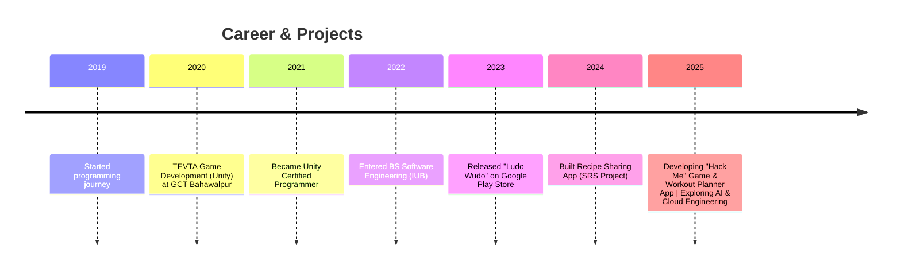

<!-- Header -->

<h1 align="center">Hi 👋, I'm Muhammad Naeem</h1>

  <em>Game Developer • Flutter Frontend Developer • Software Engineer • Pakistan</em>  

  Qualified & Professional Game Developer | Unity Certified Programmer | Flutter Developer | Passionate about AI, Cloud & Mobile App Development

---

<!-- Badges -->

  
  
  
  

  
  

  🚀 Check out my pinned projects 👉 <a href="https://github.com/mnaeem700?tab=repositories">View Projects</a>

---

## 👨‍💻 About Me

I am **Muhammad Naeem**, a **Game Developer** and **Flutter Frontend Developer** with 5+ years of experience in software development.  
I specialize in **Unity 3D Game Development, Firebase Integration, and Mobile Apps**. Currently, I am a **BS Software Engineering student (6th semester) at Islamia University Bahawalpur (IUB)**.  

I love to create games, apps, and digital experiences that make an impact.  

* 🎮 **Published Game:** *Ludo Wudo* on Google Play Console  
* 🔭 Currently working on: *Hack Me* (1000-level guessing game) & *Workout Routine Planner App*  
* 🌱 Learning: AI, Cloud Engineering, Advanced Firebase  
* 💬 Ask me about: Game Development (Unity, Multiplayer, AI), Flutter Apps, Firebase  
* ⚡ Fun fact: I started as a **freelancer**, now I build complete projects from idea → deployment  

---

## 🎓 Education

- **BS Software Engineering** — Islamia University Bahawalpur (2021–2025, in progress)  
- **Unity Certified Programmer**  
- **TEVTA Game Development Program (Unity)** — GCT Bahawalpur (3 months)  

---

## 💼 Experience

- 👨‍🏫 **Game Developer (Unity)** — Freelance projects  
- 📱 **Flutter Developer** — Mobile apps with Firebase backend  
- 🎮 **Indie Game Developer** — Released *Ludo Wudo* on Play Store  
- 🌍 **YouTube Creator** — *Neemii Data Viz*, *Neemii Gaming*, *Guided Heart* (Islamic reactions)  

---

## 🛠 Skills & Tools  

**Programming & Markup**  

**Frameworks & Tools**  

**Other**  

---

## ⚙️ Tech Stack

  <!-- Mobile -->
  
  
  <!-- Game Dev -->
  
  
  <!-- Programming -->
  
  
  <!-- Database -->
  
  
  
  <!-- Web -->
  
  
  
  <!-- Tools -->
  

---

## 🚀 Projects

### 🎮 Ludo Wudo
- Offline & Multiplayer support (2–4 players, AI robot player)  
- Published on **Google Play Console**  
- Built with Unity 3D & C#  

### 🔐 Hack Me (In Progress)
- A puzzle-based game with **1000 levels**  
- Each level is based on a **JSON record** (name, DOB, password, etc.)  
- Players guess passwords with clues  
- Built using **Flutter + Firebase**  

### 💪 Workout Routine Planner App (In Progress)
- Personalized plans based on user’s **age, weight, height, goals, and job type**  
- Categorized workouts (busy vs. free)  
- Firebase-powered backend  

### 🍴 Recipe Sharing App (University Project)
- Designed as an **SRS (Software Requirement Specification)** project  
- Allows users to share & discover recipes  
- Includes **cloud storage and search functionality**  

---

## 📊 GitHub Stats

  
  

---

## 📚 Currently Learning  

- 🚀 **Cloud Engineering (Google Cloud, Firebase Advanced)**  
- 🤖 **Artificial Intelligence & Machine Learning**  
- 🔐 **Cybersecurity Basics**  
- 🌐 **Modern Web Technologies (React, WordPress, Blogger, AdSense)**  

---

## 📅 Activity Timeline

## 🌍 Language Proficiency  

  

## 🐍 Contribution Graph  

